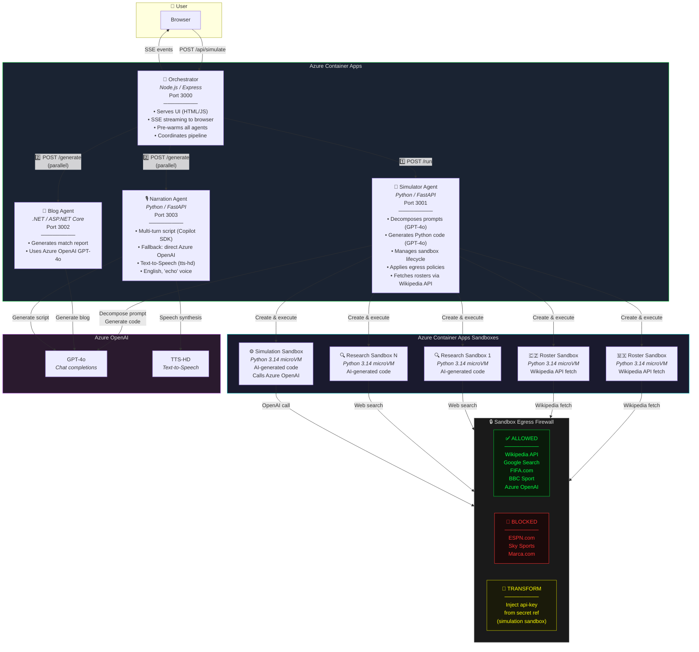

# Architecture — World Cup 2026 Match Simulator



## Flow

1. **User** submits a prompt via the browser UI
2. **Orchestrator** pre-warms all agents, streams progress via SSE, and calls the Simulator
3. **Simulator** uses GPT-4o to decompose the prompt into research queries (+ mandatory roster queries)
4. **Simulator** uses GPT-4o to **generate Python code** for each research task
5. **Roster sandboxes** (2) fetch squad data directly from Wikipedia's API (Players section)
6. **Research sandboxes** (1-3 in parallel) execute AI-generated code in isolated microVMs
   - Each sandbox has an **egress firewall** — ESPN, Sky Sports, Marca are blocked (HTTP 403)
   - Wikipedia, Google, FIFA, BBC Sport are allowed
7. **Simulator** uses GPT-4o to **generate Python simulation code**
8. A **simulation sandbox** executes the code, calling Azure OpenAI
   - With **Secure Egress**: API key is injected via Transform rule from a secret reference — code never sees it
   - Without Secure Egress: API key is passed as env var (visible in `/tmp/openai_request.txt`)
9. **Orchestrator** sends simulation results to Blog and Narration agents in parallel
10. **Blog Agent** (.NET) generates a match report article via GPT-4o
11. **Narration Agent** generates a commentary script (Copilot SDK or direct AOAI fallback) and audio (TTS-HD)

## Key Demo Points

| Feature | How it's showcased |
|---|---|
| **Container Apps** | All 4 microservices deployed to a shared environment |
| **Sandboxes — Isolation** | AI-generated, untrusted Python code runs safely in microVMs |
| **Sandboxes — Egress Firewall** | ESPN, Sky Sports, Marca blocked; Wikipedia, Google, FIFA, BBC allowed |
| **Sandboxes — Secure Key Injection** | API key injected via egress Transform rule using secret reference — sandbox code never sees it |
| **Sandboxes — Parallel Execution** | 4-6 sandboxes (roster + research + simulation) run simultaneously |
| **Azure OpenAI** | GPT-4o for code generation, simulation, blog; TTS-HD for narration |

## Secure Egress — API Key Injection

When "Secure Egress" is enabled, the simulation sandbox's egress policy includes a **Transform rule** that injects the `api-key` header for requests to Azure OpenAI:

```json
{
  "name": "inject-aoai-key",
  "match": { "host": "<your-openai-resource>.openai.azure.com" },
  "action": {
    "type": "Transform",
    "headers": [{
      "operation": "Set",
      "name": "api-key",
      "valueRef": {
        "secretRef": {
          "secretId": "aoai-api-key",
          "secretKey": "api-key"
        }
      }
    }]
  }
}
```

The secret is stored at sandbox group level and resolved at egress time. The code inside the sandbox uses a placeholder value and the real key is never exposed.
