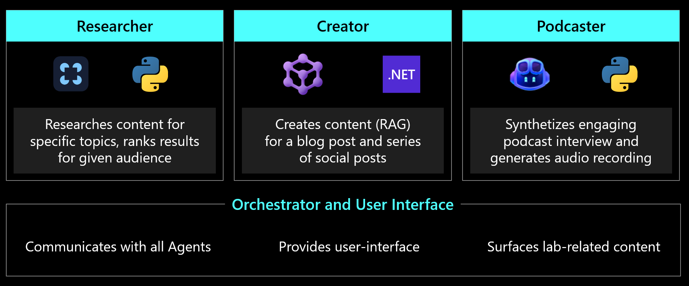
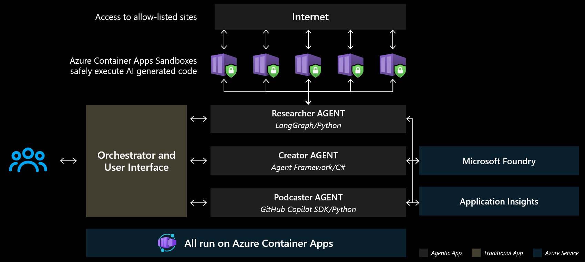
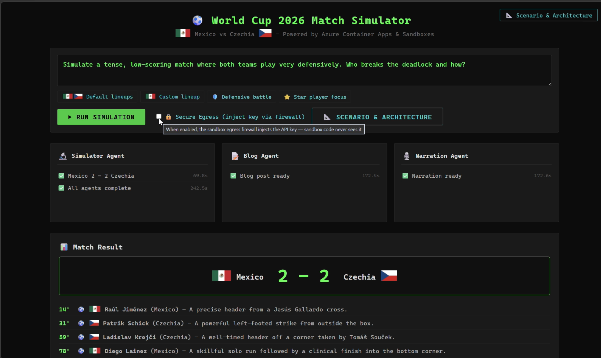
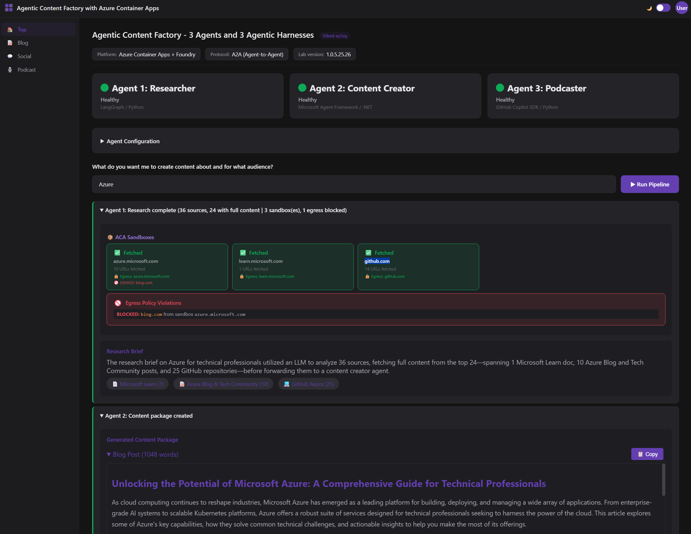

# 3 AI Agents, Real Tools and Models -- All on Azure Container Apps with Foundry

A multi-agent content factory that researches a given topic (soccer game predictions or Microsoft technology), creates multi-format content for blog and social media, and generates podcasts. Built to familiarize with running and hosting AI Agents on Azure Container Apps (including ACA Sandboxes), explore agent observability, and register and evaluate agents in Microsoft Foundry.

## Architecture
Find below details about how the outcomes are achieved. This solution can be run locally or deployed to Azure with 'AZD UP'.

### High Level Architecture
The solution has four key componenets -
1. **Orchestrator and User Interface** - facilitates interaction with a user - configuration, prompts ans presets the result. On the background it orchestrates the flow among the agents mentioned below. IT Kickc off Agent 1 and passed the outcomes to Agent 2 and 3. 
2. **Agent 1** (LangGraph / Python) — Researches given topic (soccer game predictions or Microsoft technology). Uses AI for intent detection, ranks sources by relevance, fetches full content from top hits, follows depth-1 links from trusted domains, and synthesizes a research brief. It swarms to ACA Sandboxes with per-domain egress policies to safely research domain specifc information and passes it back to the main agent. Each isolated sandbox reports status and enforces blocked outbound requests.
3. **Agent 2 — Content Creator** (Microsoft Agent Framework / .NET) — Transforms the research brief into an original blog post and social posts, all grounded in real sources.
4. **Agent 3 — Podcaster** (GitHub Copilot SDK / Python) — Creates an engaging podcast script and generates audio. Can use Azure OpenAI TTS for text to speech transformation.

### Detailed Architecture
As you see in more detailed architecture, the solution runs three polyglot AI agents (LangGraph, MS Agent Framework, GitHub Copilot SDK) on Azure Container Apps, using ACA Sandboxes to safely execute AI-generated code with egress locked to allow-listed sites. The agents connect to Microsoft Foundry for AI model inference (GPT-4o, TTS) and are fully instrumented with Application Insights for end-to-end observability.

## Next Steps
Determine which version you would like to use for detailed information -

| Item | Option 1 - [Soccer game predictions](Option1/) | Option 2 - [Research of a Microsoft technology](Option2/)|
| --- | --- | --- |
| Preview |  |  |
